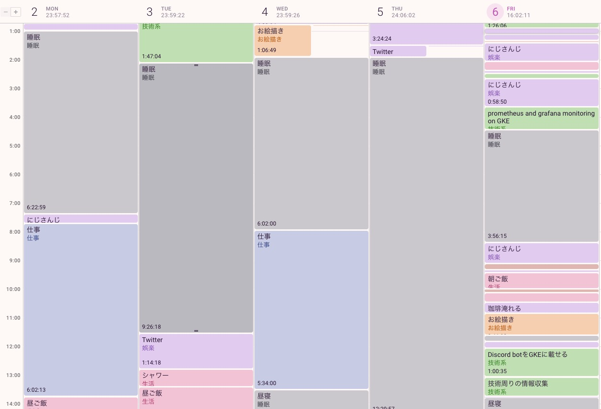
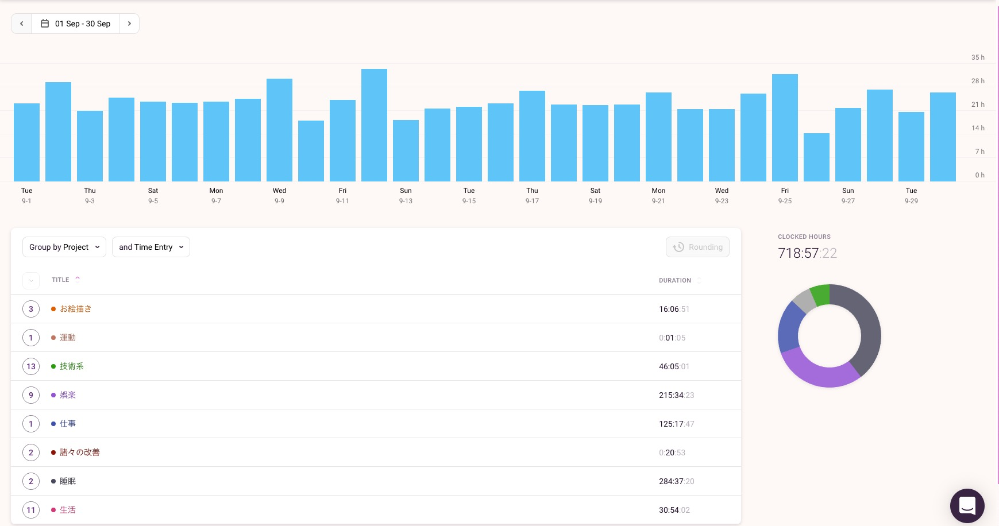
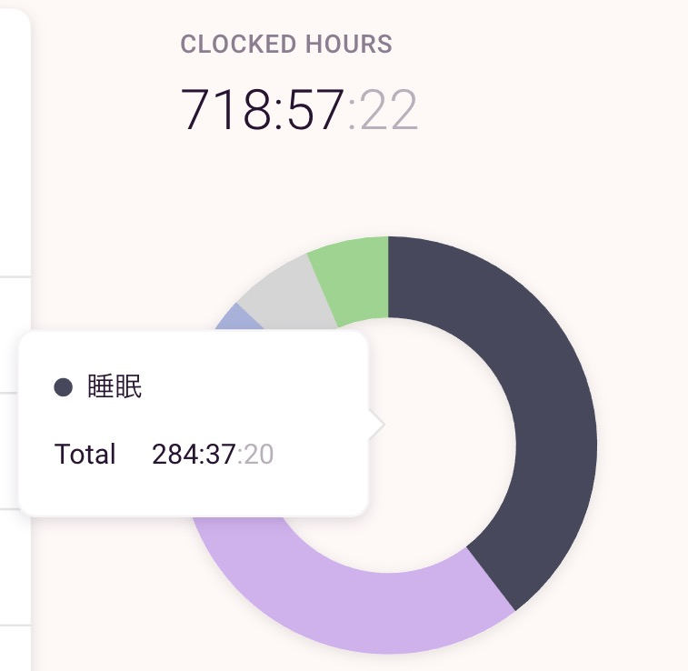
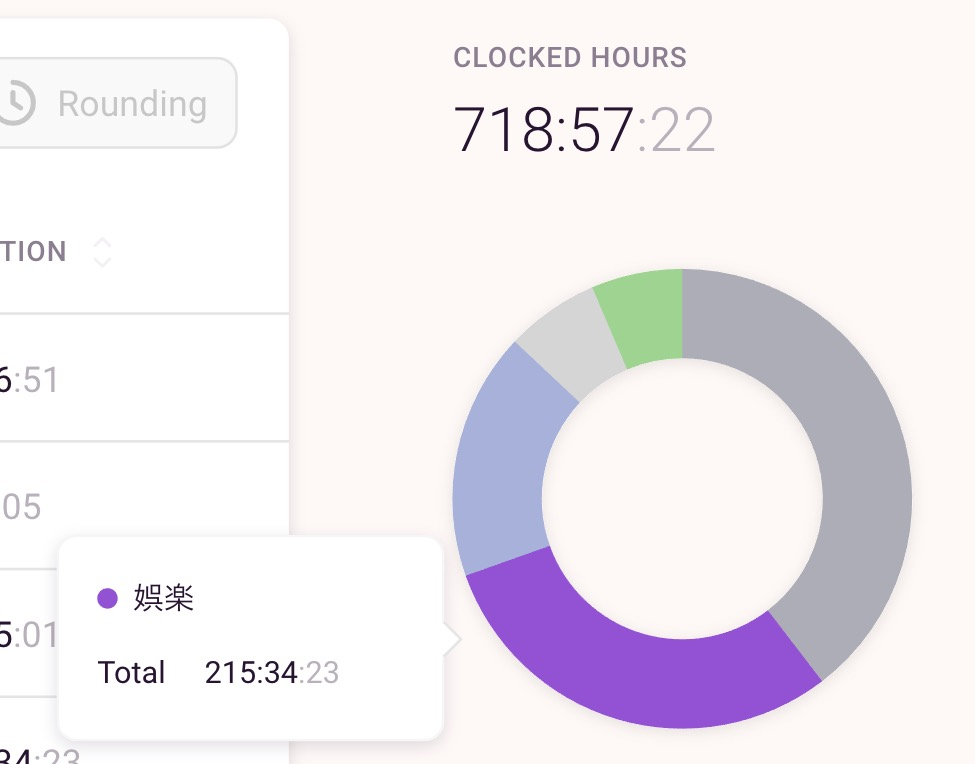
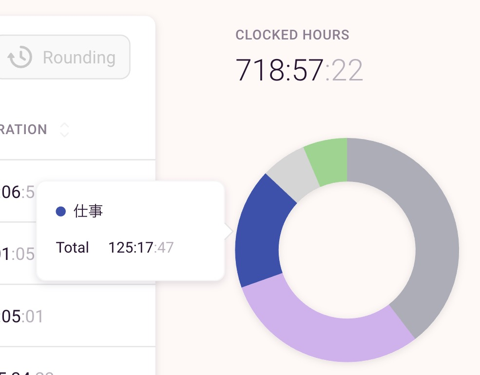
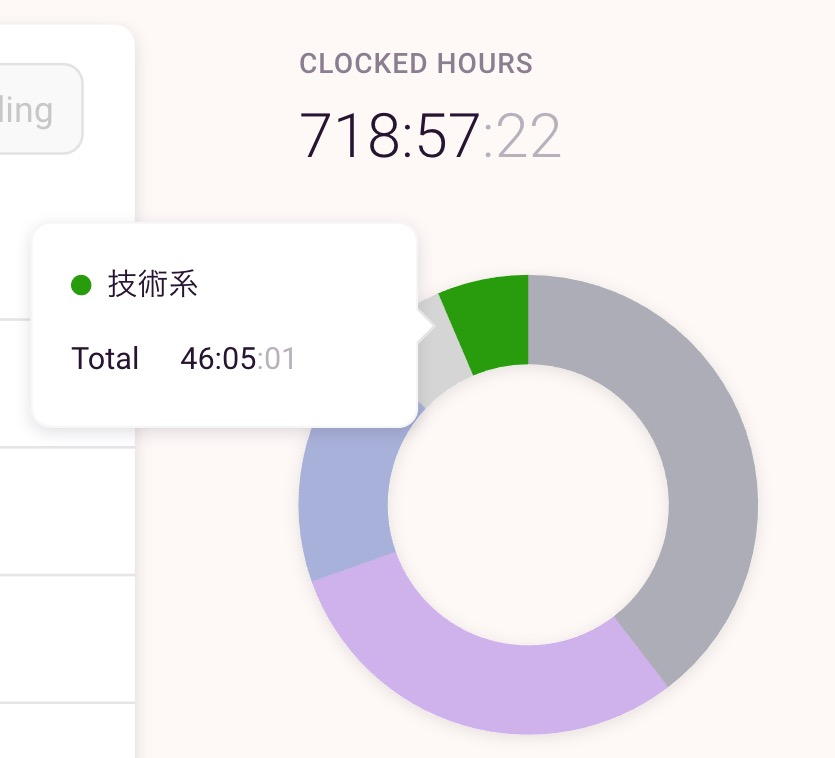
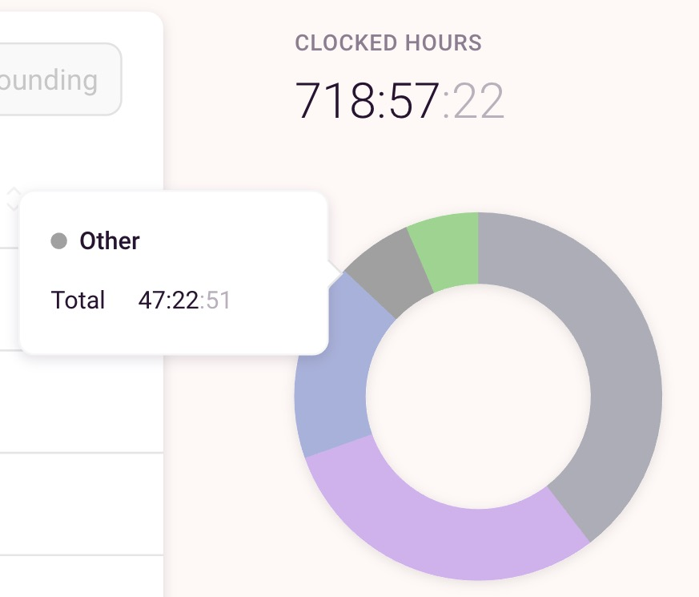
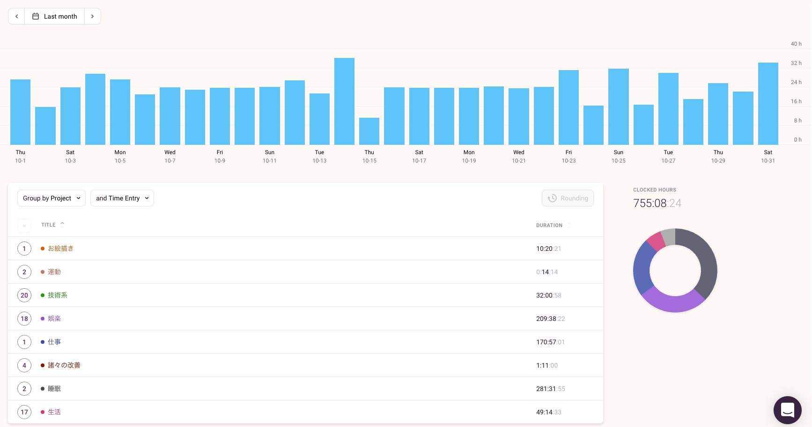

8月の末から[Toggl](https://toggl.com/)というタイムトラッキングアプリであらゆる時間を計測しています。  
にじさんじ所属のVTuberシスター・クレアさんが [8月のトークテーマ雑談。](https://www.youtube.com/watch?v=ebGCkBpIZq0) の中で
一日の行動の円グラフにして書いていたのをみて、可視化すると面白いなと思ったのがきっかけです。  

## トラッキングしてみた感想

実際に2ヶ月自分の生活をトラッキングしていると、各行動にどのくらい時間がかかるのか見積もりできるようになって良いです。  
例えば、私はシャワーを浴びて、髪を乾かして服を着替えるまでに大体15分かかるんですが、この情報は寝起きで仕事前にシャワーを浴びるかどうかの判断に重宝しています。

このブログを書いている途中で気づいたメリットとして、1ヶ月の振り返りとしても便利ですね。  
時間だけで成果を見ることはできませんが、目安の一つとしては良い情報です。

不満としてはTogglの提供しているレポート結果が個人的には若干物足りないなというぐらいです。  
APIが叩けるようなので、手が空いたときにGrafanaで可視化出来たりすると面白いなと思っています。

## 今週のタイムテーブル

タイムテーブルのような表示もできるので、入眠が遅いなどに気付けるのが良いです。  
もう少し早く寝たほうが良さそうですね。

## 9月のレポート

9月のトラッキング結果は以下のようになっていました。  
記録のとり方として、プロジェクトはカテゴリ的な使い方をして、タグはあまり活用していません。  
あまり細かくすると面倒になって記録しなくなると感じたため、何をしたかはタイトルに記載しています。

### 全体のレポート

718.57h/30days = 23.952333333h 大体24時間分の記録ができています。

8月の中ごろから趣味として始めたお絵描きが16時間と割と長いですね。  
一日30分〜1時間ぐらい週に3日ぐらいやっていたので、そんなもんかなという印象です。

睡眠>娯楽>仕事の時間が大部分をしめています。

### 睡眠時間

カテゴリ内で最も長い時間をしめています。  
私は十分に睡眠を取らないと週末に起きれなくて24時間寝続けるなんてことが発生するため、普通よりも長めだと思います。

284h/30days = 9.466666667h

昼寝もこみで9時間以上寝ている計算です。  
8時間睡眠でも十分な気がするので、効率的な睡眠がとれていないのかもしれません。

### 娯楽の時間

Twitterしたり、にじさんじの配信をみたり、漫画を読んだりしている時間です。  
内訳はにじさんじが161時間、Twitterが19時間と大部分をしめていました。

- 全体:215h/30days = 7.166666667h
- にじさんじ:161h/30days = 5.366666667h
- Twitter:19h/30days  = 0.633333333h

実際はにじさんじの配信をみながらTwitterをしたり、プログラミングしたりしているのですが、
配信をみながらだと集中できていないことが多いので、全て娯楽として計測しています。

### 仕事の時間

文字通り仕事の時間です。  
会社PCを開いたタイミングから計測して、閉じるまでを計測しています。  
リモートワークなので通勤時間は0です。通勤の必要がある時は、家を出てから帰ってくるまでを計測する予定です。

これ以上短くも長くもならないんじゃないかと思います。

### 技術周りにかけた時間

技術系の調べ物、プログラミング、技術ブログを書くなどにかけた時間です。  

46h/30days = 1.533333333h

ながら作業とかではなく、それをメインにやっている時を計測しています。  
09/12に[ISUCON10予選](http://isucon.net/archives/54704557.html)に参加していたため、そこで10時間ぐらいかかっています。

### 9月のその他の時間

ご飯を食べる、シャワーを浴びるなどの時間ですが、短いのでまとめられているようです。

## 10月のレポート

大体9月と似たような状況だったので概要だけ記載します。

- 睡眠:281h
    - 一日あたり:9.064516129h
- 娯楽:209h
    - 一日あたり:9.064516129h
- 仕事:170h
- 技術系:32h
    - 一日あたり:1.032258065h

睡眠時間と技術系にかける時間を削って、娯楽にかける時間が増えています。  
ISUCON以降、目標もたてずに過ごしていたことが技術系にかける時間が減った原因になっていそうなので、課題を見つけて取り組もうと思います。

## 最後に

これを書いている間に改善点も浮かんできたので11月の終わりにまた振り返りとしてレポートを見返してみたいですね。  
可視化楽しいので、もうしばらく続けてみようと思います。
