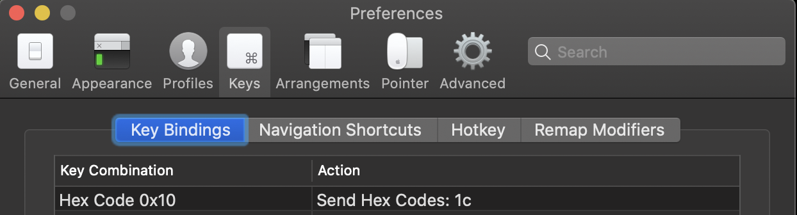
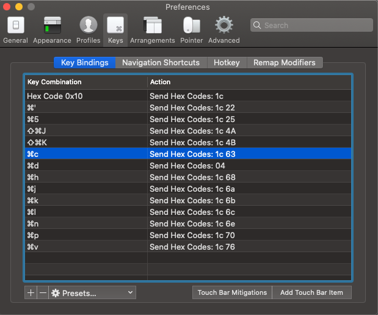

I've been looking for the best key for a tmux prefix key for several years now.  
Considering Vim's keymap and terminal shortcuts, it's a prefix key. There are almost no usable combinations left.  
(Ctrl+a, which is set as the default prefix key on tmux, is used for bash It's covered with a shell.)  

So I've been experimenting with various combinations, and recently, if I were on a Mac, I'd use the Command key. Why not use it as a prefix key?  
It's pretty good.  
The advantage of using the Command key as a prefix key is.

- It's in an easy to press position.
- You can use the terminal tools (vim, bash, and other CLI tools) and shortcuts to create There's nothing to bat for (maybe).

Being in a position where you can press with your thumb is pretty important as someone who lives in a terminal.  
If you use a prefix key such as Ctrl which you press with your pinky finger, your pinky finger is dead.  
You can press Command key to make it work as a prefix key, or you can press ` It is also possible to set the Command key + '` as the tmux pane splitting key, etc. (This is quite an advantage.
(This is also quite an advantage.)

## Precondition

- We have confirmed the operation in the following environments
    - macOS Catalina version 10.15.5
    - iTerm2 Build 3.3.11
    - tmux 3.0a

## Configuration

Iterm2 has the ability to register your own keyboard shortcuts from the beginning.  
I can perform various actions (scrolling, copying, etc.) when I type a shortcut. And there is one such action called "Send Hex Code". As the name suggests, this action sends you an ASCII code when you type a shortcut.  
You can use this to have the command key send you the ASCII code of the key you set as the tmux prefix key when you enter the command key.

You can find out which key corresponds to what hexadecimal number in the ASCII code at the following site

ASCII : https://en.wikipedia.org/wiki/ASCII

### tmux-side configuration

Actually, the tmux prefix setting isn't just about anything. (This is a slight disadvantage.)  
From a tmux point of view, we can use `Ctrl-<Space>` as a prefix key.  
The function of "send Hex Code" above is to send the same type of code as listed in the ASCII code table above. character or control characters are only supported.  

So, I use control characters that you may not normally use as a prefix key.  
See Wikipedia for an overview of ASCII control characters and their descriptions.

https://en.wikipedia.org/wiki/ASCII

I set up `Ctrl + \` as a prefix key for tmux. (The control character is File Separator.)

If you want to write it as a `.tmux.conf` setting, you can write it as follows: `Ctrl + .tmux.conf` (with two back-quotes to escape). (Two back-quotes are added for escaping.)

```
# prefix key
set -g prefix C-\\
```

### Configuring the Iterm2 side

Next, let's set up Iterm2. It is set from Preferences of Iterm2. (How to open Preferences is `Command key + ,`)  
You can register a new keyboard shortcut from Preferences > Keys > Keys > Key Bindings, using the + button in the bottom left corner.  

Using my settings as an example

1. press the + button at the bottom left of Preferences > Keys > Key Bindings.
2. you want to use a single press of the Command key as a prefix key, so you can use the " Click on "Keyboard Shortcut" and press the Command key
3. select "Send Hex Code" in Action
4. the control set up as a prefix key there as the input column comes out under the Action. Enter the character's ASCII code.
    - (I set File Separator as the prefix key, so I'll enter its ASCII code, 1c.)

With the above settings, the image below should look like this.



Now you can use Command key as a prefix key. That's it. Thank you for your hard work.

### Extra

As an application of the previous settings, we will try to make `Command + '` behave as if you had pressed the ' key after pressing the prefix key (tmux's default setting is to split the pane).

1. press the + button at the bottom left of Preferences > Keys > Key Bindings.
2. you want to use the `Command key + '` as a prefix key, so you can use the " Click on "Keyboard Shortcut" and press the Command key
3. select "Send Hex Code" in Action
4. the control set up as a prefix key there as the input column comes out under the Action. Enter the character's ASCII code with a space and the key's ASCII code (22) Enter.
    - (I set up File Separator as a prefix key, so I'll enter its ASCII code, 1c.)

You can register `Command + '` as a shortcut to pane splitting.  
It is useful to register frequently used tmux operations as a shortcut in this way. My configuration was as shown in the following image.



I recommend using the Command key as a prefix key because it is gentle on your little finger.  
Please give it a try if you like.
